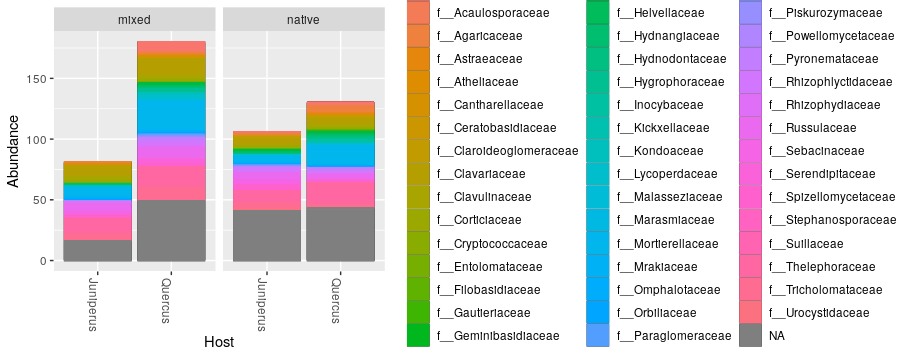
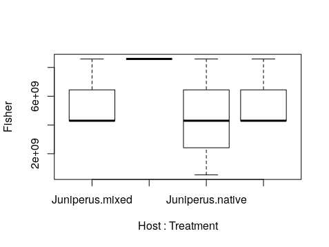

### Análisis de secuencias de ITS2 de hongos para diversidad de OTUS en bosques nativos y mixtos de Quercus y Juniperus

Se realizó un barplot de la abundancia de OTUS según hospedero (Quercus/Juniperus) y por tratamiento (Nativo/Mixto)

Se realizó un análisis de Anova por hospedero y tratamiento. 

### Resultados two-way Anova

               Df    Sum Sq   Mean Sq F value Pr(>F)
Host            1 1.271e+19 1.271e+19   1.781  0.219
Treatment       1 1.271e+19 1.271e+19   1.781  0.219
Host:Treatment  1 1.946e+18 1.946e+18   0.273  0.616
Residuals       8 5.707e+19 7.134e+18  

### Resultados Test de Adonis

              Df SumsOfSqs MeanSqs F.Model      R2 Pr(>F)   
Host            1   0.74660 0.74660  4.0820 0.28598  0.005 **
Treatment       1   0.28336 0.28336  1.5492 0.10854  0.265   
Host:Treatment  1   0.11751 0.11751  0.6425 0.04501  0.625   
Residuals       8   1.46320 0.18290         0.56047          
Total          11   2.61067                 1.00000          
---
Signif. codes:  0 ‘***’ 0.001 ‘**’ 0.01 ‘*’ 0.05 ‘.’ 0.1 ‘ ’ 1
